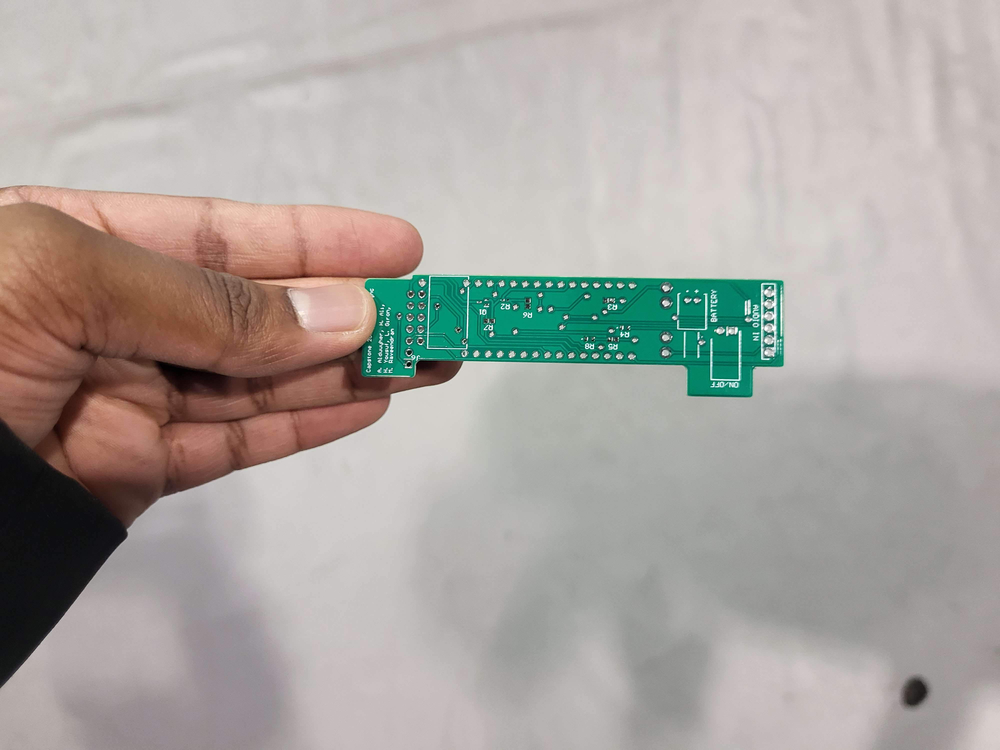
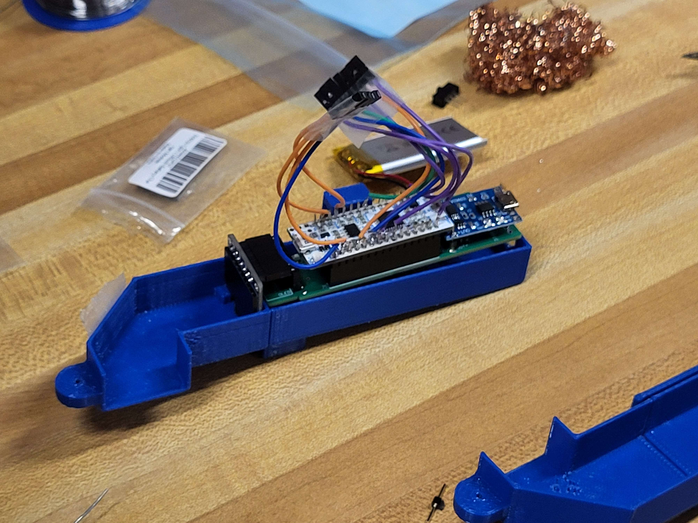
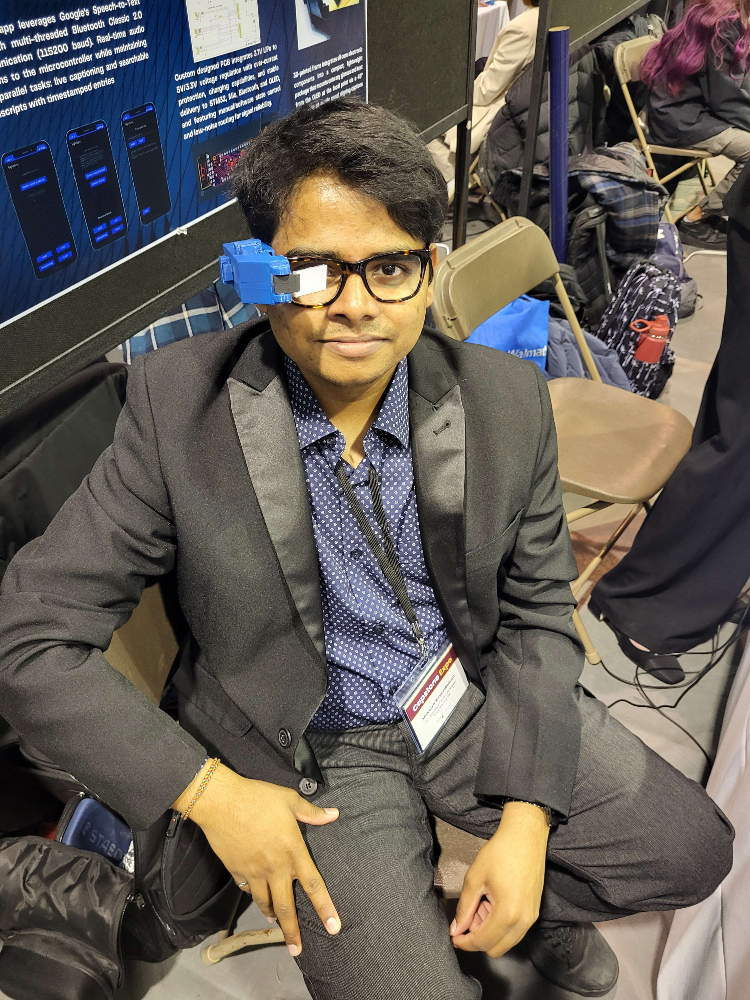

# 📱 Sight Sync – Transcription Glasses (Embedded Systems Capstone)

**Type**: Capstone / Embedded Systems  
**Technologies**: Java, Android Studio, STM32, I2C, OLED, Bluetooth, Speech-to-Text API  
**Timeline**: Sept 2024 – Apr 2025  
**Team Size**: 5

---

## 🔍 Overview

Sight Sync is an assistive wearable device designed to transcribe spoken words into live text, displayed on a transparent HUD (Heads-Up Display) mounted on eyeglasses.

The system integrates:
- An Android mobile app for continuous speech-to-text processing
- Bluetooth communication between phone and STM32 microcontroller
- I2C-driven OLED display for real-time text projection
- Custom-designed mirror-lens HUD for transparent viewing

---

## ⚙️ Features

- ✅ Real-time speech-to-text transcription using Android's Speech API  
- ✅ Bluetooth data transfer to STM32 microcontroller  
- ✅ I2C communication to OLED screen for text rendering  
- ✅ Mirror-lens system for transparent projection  
- ✅ Hands-free, wearable format for accessibility

---

## 🧠 System Architecture

```plaintext
[Android App]
    ↓ Bluetooth
[STM32 Microcontroller]
    ↓ I2C
[OLED Display]
    ↓ Mirror Projection
[HUD Lens on Glasses]

## PCB - Design



## Integrated System



## 📸 Demo – Device Photo in Use


